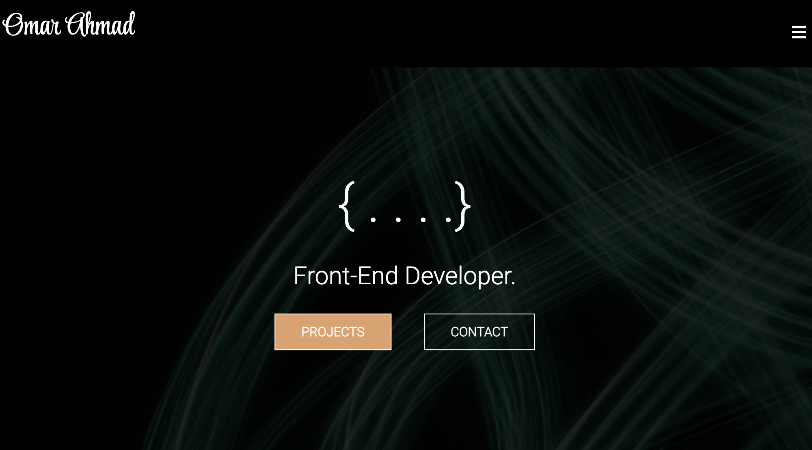

# REACT Portfolio

## Description

Create a portfolio website that utilises React, React-Router, Props, useState

The goal of the project was to create a portfolio website that uses components for :
- Header
- Home Page
- Projects Page
- Contact page

## Table of Contents (Optional)

- [Screenshot](#Deployment)
- [Credits](#credits)
- [License](#license)

## Deployment

Link to deployed site: https://omar-ahm.github.io/React_Portfolio/

## Usage

The use case of this project is to demonstrate the ability to build a web application utilising relevant experience gained throughout the week. 

Demonstrate previoously built projects through the course of the bootcamp

Use skills gains to implement into the application using React JS

## Credits

- gh-pages repo link provided in class 
- React useState documentation - https://beta.reactjs.org/reference/react/useState
- React bootstrap - https://react-bootstrap.github.io/layout/grid/
- Get Bootstrap - https://getbootstrap.com/docs/4.0/components/card/#header-and-footer

## License

- This project uses the MIT licence, please refer to the licence section for more details.
---